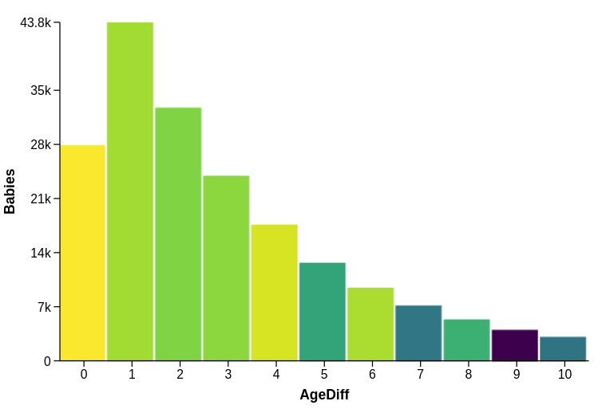

# P4: Portable Parallel Processing Pipelines

P4 is JavaScript library for accelerating data processing and visualization using the GPU. P4 provides an intuitive and declarative API for specifying common data transformations and visualizations, which automatically compile to WebGL shader programs for parallel computing.

For data processing, P4 is more than 10X faster than codes based on JavaScript Array functions. For visualizing large data, P4 is at least 10X faster than Canvas, and 20X faster than SVG.

## Table of Contents
- [P4: Portable Parallel Processing Pipelines](#p4-portable-parallel-processing-pipelines)
  - [Table of Contents](#table-of-contents)
  - [Installation](#installation)
  - [Example](#example)
  - [Current Limitations and Known Issues](#current-limitations-and-known-issues)
  - [Reference Paper](#reference-paper)


## Installation

Install using npm
```bash
npm install p4.js
```

or include the following line in your html:
```html
<script src="https://github.com/jpkli/p4/dist/p4.js"></script>
```

## Example


```javascript
p4({container: 'body', viewport:[800, 600]})
.data({
  type: 'json',
  data: [{BabyWeight: 9, Gender: 'Girl', MotherAge: 28, FatherAge: 32}, ...]
})
.view([{width: 800, height: 600}])
.derive({ AgeDiff: 'abs(FatherAge - MotherAge)' })
.match({ AgeDiff: [0, 10] })
.aggregate({
  $group: 'AgeDiff',
  $collect: {
    Babies: {$count: '*'},
    AvgWeight: {$avg: 'BabyWeight'}
  }
})
.visualize({
  mark: 'bar',
  x: 'AgeDiff',
  height: 'Babies',
  color: 'AvgWeight'
})
```
The above codes process a dataset with 100K records and visualize the result as a bar chart shown below.



## Current Limitations and Known Issues
 - Only 24-bit, single floating point precision is supported.
 - Data size cannot be larger than the max size supported by WebGL texture, which is typically 8096 x 8096.

## Reference Paper

Li JK, Ma KL. [P4: Portable Parallel Processing Pipelines for Interactive Information Visualization](https://ieeexplore.ieee.org/abstract/document/8468065). IEEE transactions on visualization and computer graphics. 2018 Sep 19.